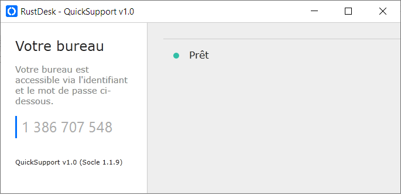

   

🖥️ Windows distribution 

✅ Windows 11 ✅ Windows 10   ❌ Windows 7

<b>Simple RustDesk Client Version Quick Support</b>

- Juste un simple ID
- Pas de mot de passe (Seul l'utilisateur distant peux accepter la connexion)

Cette version est a déployer sur les postes clients et le technicien utilisera la version standard dispo ici : https://github.com/rustdesk/rustdesk
